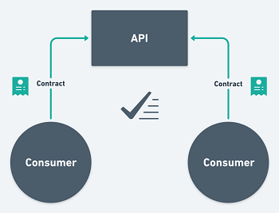
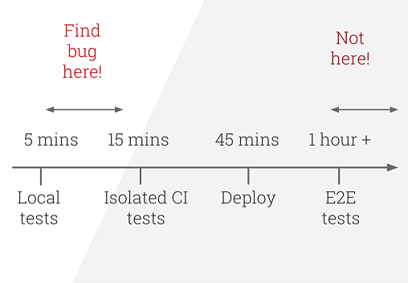
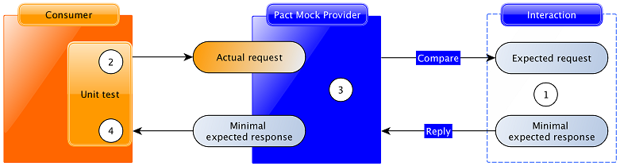

## What is contract testing?
Contract testing is a technique for testing an integration point by checking each application in isolation to ensure the messages 
it sends or receives conform to a shared understanding documented in a "contract".
For applications that communicate via HTTP, these "messages" would be the HTTP request and response
 and for an application using queues this would be the message that goes on the queue.

  

What sets this form of testing apart from other approaches is that each system is 
able to be tested independently.
Also, the contract will be generated by the code itself, meaning it will be always up to date with reality.

## What are the benefits of contract testing?
It's helpful first to consider where contract testing sits within the context of a broader automation testing approach.
 When coming up with a test automation strategy, a good rule of thumb in how you should expend your effort is the approach
 advocated in Mike Cohn's "Test Pyramid":

 

Stick to the pyramid shape to come up with a healthy, fast and maintainable test suite:
- Write lots of small and fast unit tests. 
- Write some more coarse-grained tests and very few high-level tests that test your application from end to end.

Contract tests fit in the "Service Tests" layer, as they execute quickly and don't need to integrate to external systems to run. 
Their job is to give you confidence that the systems you integrate with are compatible with your code before you release.

Some pros of contract testing:

- They run fast, because they don't need to talk to multiple systems.
- They are easier to maintain: you don't need to understand the entire ecosystem to write your tests.
- They are easy to debug and fix, because the problem is only ever in the component you are testing.
- They uncover bugs locally, on developer machines: contract tests can and should run on developer machines prior to pushing code.

  

## What is consumer-driven contract testing?
With contract testing, we want to ensure that a service works between a consumer and an  provider. 

What happens when the provider changes a part of the service? You will need to know if the consumer can still use the service
and whether the changes still meet the demands of the consumer’s contract. 
 This is when you need to perform consumer-driven contract testing.

Since these contracts are written and managed exclusively by consumers, providers must first obtain permission
 from consumers before they can make any changes.  If providers need to implement new features, they can see which consumers 
 would be affected by the changes by looking at the status of the contract tests.

 ## How does PACT work?
 A contract between a consumer and provider is called a pact. Each pact is a collection of interactions, and each interaction 
 describes:
 
 - For HTTP:
     - An expected request describing what the consumer is expected to send.
     - A minimal expected response - describing the parts of the response the consumer wants the provider to return.  
 
 - For messages:
     - The minimal expected message - describing the parts of the message that the consumer wants to use.

Consumer Pact tests operate on each interaction described earlier to say "assuming the provider returns the expected response 
for this request, does the consumer code correctly generate the request and handle the expected response?".

  

### Steps for creating a PACT test in the consumer
1. Using the Pact DSL, the expected request and response are registered with the mock service.
2. The consumer test code fires a real request to a mock provider (created by the Pact framework).
3. The mock provider compares the actual request with the expected request, and emits the expected 
response if the comparison is successful.
4. The consumer test code confirms that the response is correct.

### Sharing the contracts with the provider team
After being ran, the consumer tests produce a contract (the pact file) as an artefact.
We will need to share it with the team responsible for managing the producer, so that they can confirm they meet
 all of the expectations set in it. 
 There are multiple ways to share pacts, being the recommended approach is to use a Pact Broker.